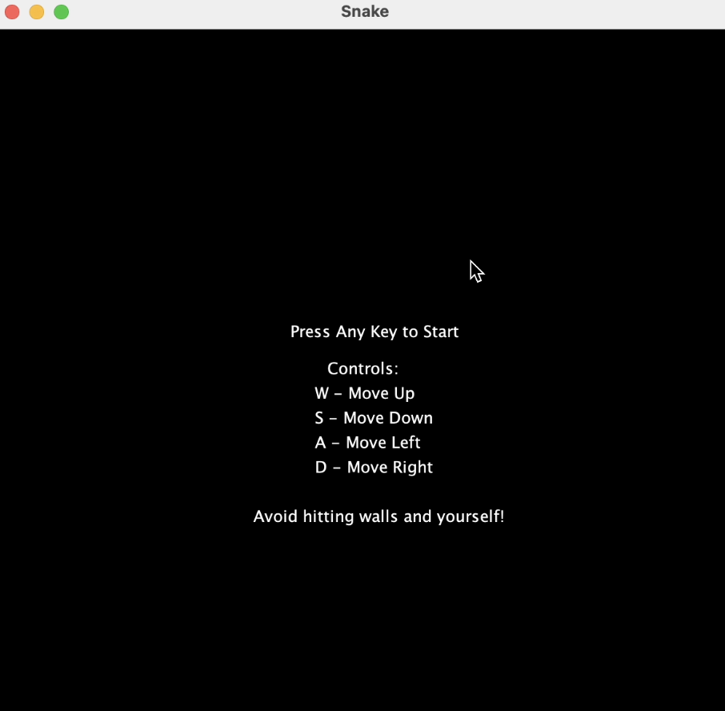
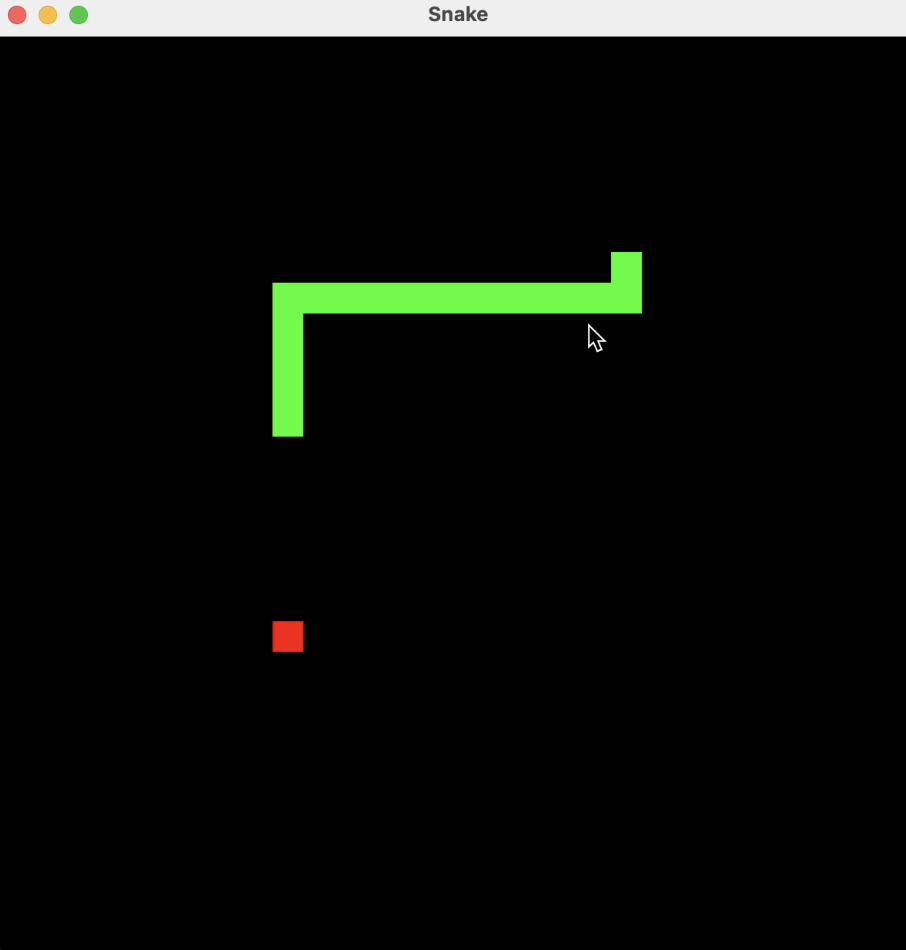
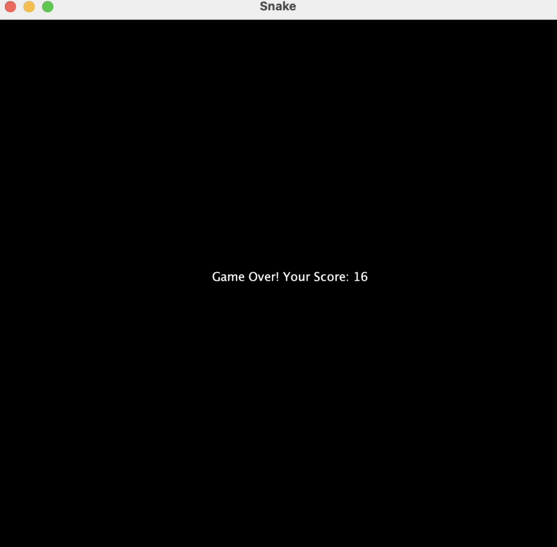

# 🐍 Java Snake Game  

A **classic Snake game** built using **Java**, **Swing**, and **AWT** for GUI rendering. The game follows traditional mechanics:  
- The **snake grows** when it eats food 🍎.  
- The **game ends** if the snake **hits the wall or itself**.  

This project is great for **beginners** learning Java GUI programming and event handling.

---

## 📌 **Table of Contents**
- [🕹️ Game Rules](#-game-rules)
- [🛠️ Technologies Used](#️-technologies-used)
- [📚 Libraries & Functions](#-libraries--functions)
- [🖥️ Game Preview](#️-game-preview)
- [🚀 How to Run](#-how-to-run)
- [🎯 License](#-License)

---

## 🕹️ **Game Rules**
- Use **W** 🡅 to move **Up**  
- Use **S** 🡇 to move **Down**  
- Use **A** 🡄 to move **Left**  
- Use **D** 🡆 to move **Right**  
- The **game ends** if the snake:  
  - **Hits the wall** 🚧  
  - **Collides with itself** 💀  

---

## 🛠️ **Technologies Used**
- **Java 8+**  
- **Swing & AWT** (Java GUI components)  
- **Object-Oriented Programming (OOP)**  
- **Event Handling (KeyListener for controls)**  

---

## 📚 **Libraries & Functions**
The project uses **Java's built-in** libraries:  

| Library         | Purpose |
|----------------|---------|
| `javax.swing.*` | Used for GUI (JFrame, JPanel) |
| `java.awt.*`    | Handles game graphics & rendering |
| `java.awt.event.*` | Captures keyboard input (KeyListener) |

### **Important Functions**
| Function | Description |
|----------|-------------|
| `Snake.move()` | Moves the snake based on direction |
| `Snake.grow()` | Adds a new segment when eating food |
| `Game.update()` | Checks collisions, food consumption, and updates game state |
| `Graphics.paintComponent()` | Renders the game on screen |
| `Food.random_spawn()` | Places food randomly on the grid |

---

## 🖥️ **Game Preview**

### 🏁 Start Screen


### 🐍 Gameplay


### ☠️ Game Over



---

## 🚀 **How to Run**
### **Method 1: Run in an IDE (IntelliJ, Eclipse, VS Code)**
1. Clone or download the repository.  
2. Open the project in your preferred **IDE**.  
3. Compile and run `Main.java`.

### **Method 2: Run in Terminal**
1. Open the terminal in the project folder.  
2. Compile the game:  
   ```sh
   javac Main.java
3. Run the game:
   ```sh
    java Main

---

## 📝 License

This project is licensed under the **MIT License**.  
You are free to use, modify, and distribute this software as long as the original license is included.  

📄 See the [LICENSE](LICENSE) file for more details.
